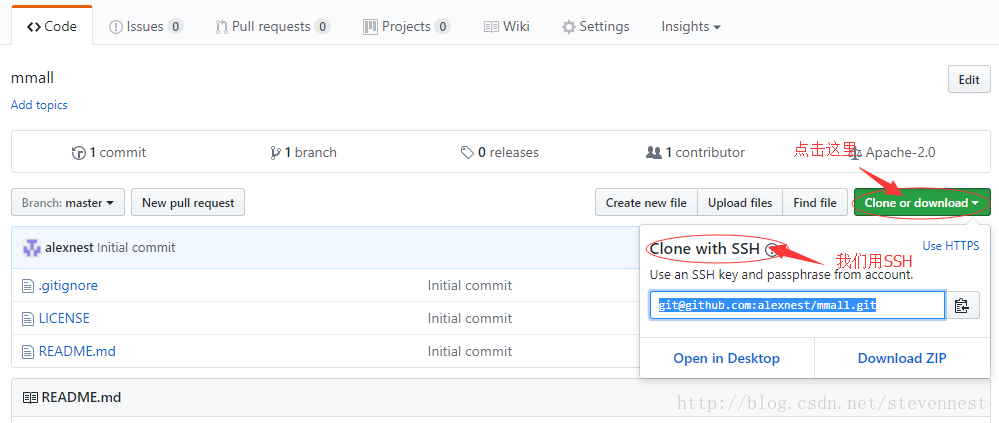

# 注册一个GitHub账号
  点击[注册地址](https://github.com/join?source=experiment-header-dropdowns-home)注册账号

# 配置公私钥
  在github右上角头像中点击下三角符号，点击Help菜单，搜索"SSH"，点击[Adding a new SSH key to your GitHub account](https://help.github.com/articles/adding-a-new-ssh-key-to-your-github-account/)查看如何配置公私钥。

# 在GitHub上创建个人仓库
  在github右上角"+"号点击下三角符号选择"New Repository"

# 首次把本地仓库同步到GitHub
1.  打开gitbash客户端
2.  跳转项目根目录
    ```
    cd VD-APP-AICITY
    ```
3. 初始化项目
    ```
    git init
    ```
4. 添加到本地缓存区
    ```
    git add .
    ```
5. 提交已修改文件并添加注释
    ```
    git commit -m 'first init project'
    ```
6. 查看项目ssh路径并拷贝下来
   

7. 链接远程仓库 
    ```
    git remote add origin git@github.com:alexnest/mmall.git
    ```
8. 首次提交到远程仓库（只限首次，之后提交不能用此命令）
   ```
   git push -u -f origin master
   ```
